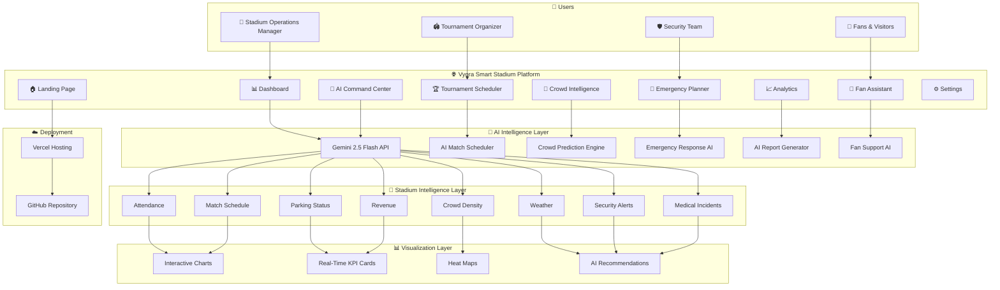

# 🏗️ System Architecture

---

## 🏛️ Architecture Overview

Vyora is an AI-powered Smart Stadium Operations Platform designed to improve operational efficiency, crowd safety, tournament management, and fan engagement.

### Frontend Layer
- React 19
- Vite
- Tailwind CSS
- Framer Motion
- Recharts
- React Router

### AI Layer
- Google Gemini 2.5 Flash
- Natural Language Processing
- AI Scheduling
- Crowd Prediction
- Emergency Planning
- Fan Assistance
- Report Generation

### Intelligence Layer
- Live Attendance
- Crowd Density
- Parking Occupancy
- Revenue Monitoring
- Weather Information
- Security Alerts
- Match Scheduling
- Medical Alerts

### Visualization Layer
- Interactive Dashboards
- Real-Time KPIs
- Live Charts
- AI Recommendations

### Deployment
- GitHub
- Vercel
